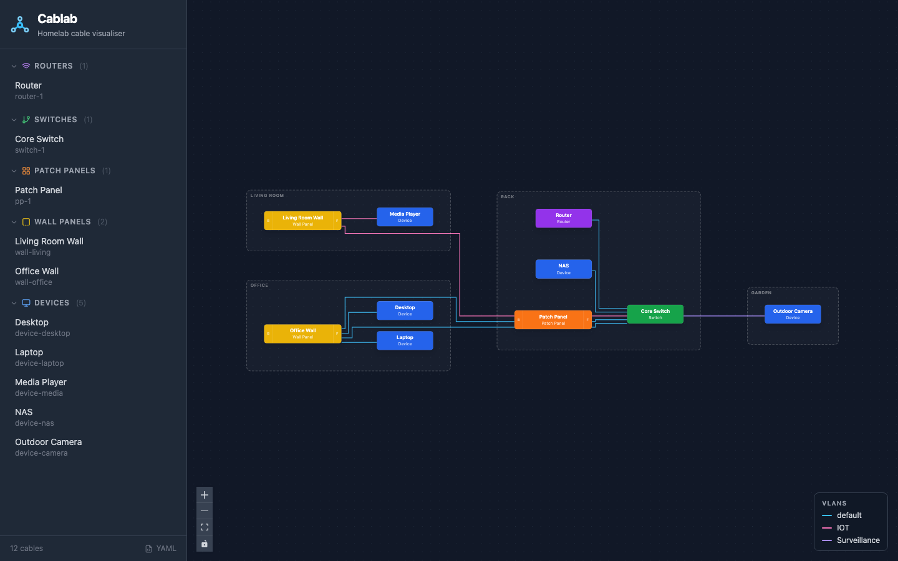
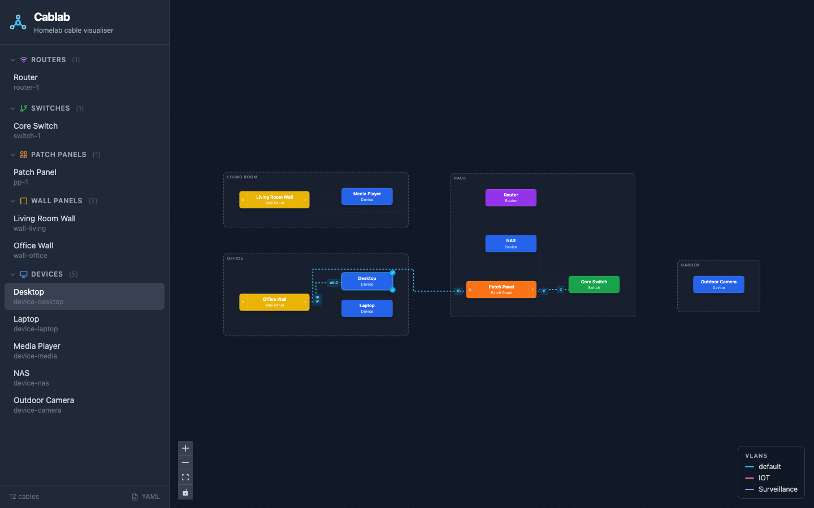
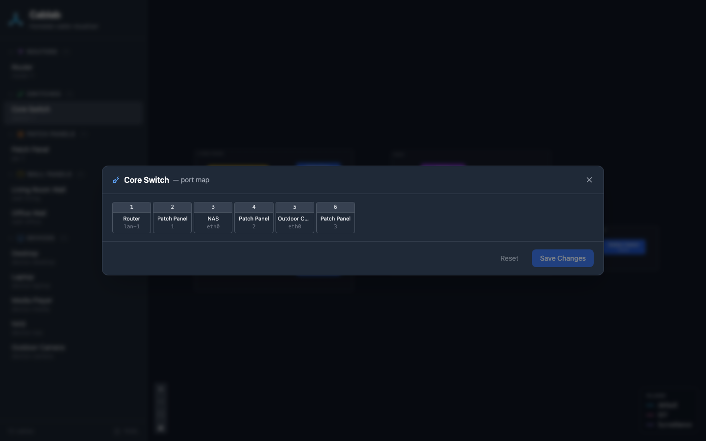
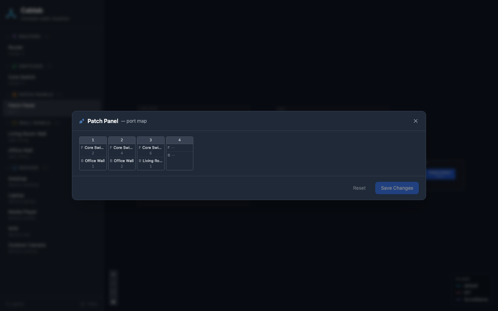
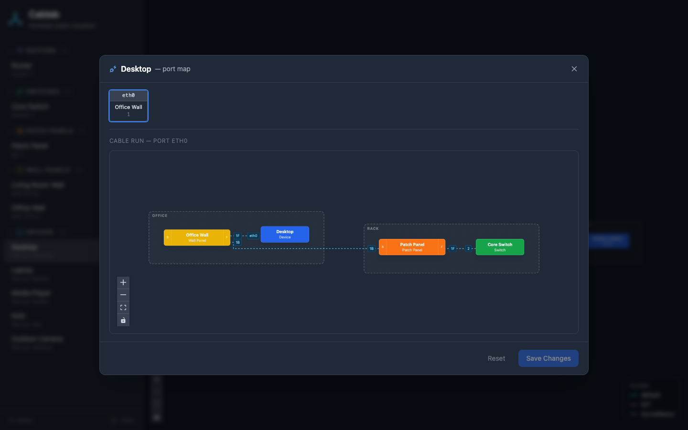
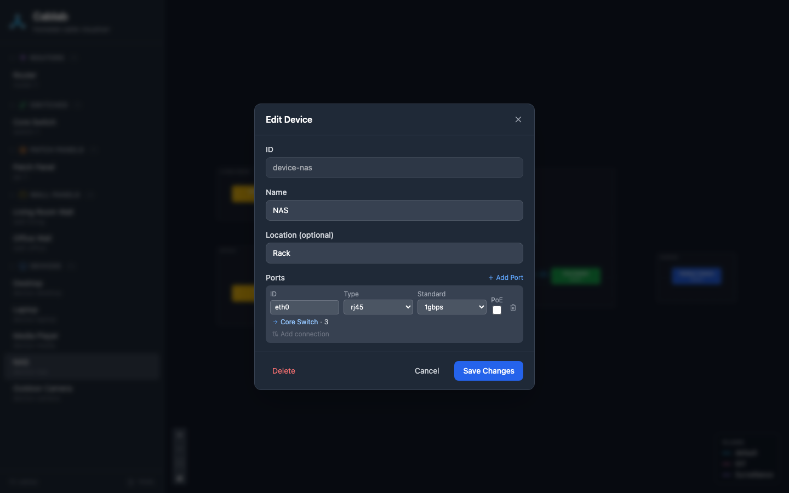

# Cablab

Cablab is a homelab network topology visualiser. Define your physical network — devices, switches, routers, patch panels, and wall ports — in a YAML file, then explore the cabling interactively in a browser.

It's aimed at homelab owners who want a clear picture of where every cable actually goes: through which patch panel port, into which wall socket, out to which device. The data lives in a single plain-text YAML file that you own and can version-control.



## Features

- **Interactive graph** — zoom and pan; layout auto-calculates with ELK
- **Cable run highlighting** — click any entity to see its full cable run highlighted, traced through every patch panel and wall port to the other end
- **Port map** — press `V` on any entity to see a per-port grid; click a port to see its cable run as a subgraph
- **VLAN colouring** — connections on a named VLAN are drawn in a consistent colour; a legend shows all active VLANs
- **Passthrough panels** — patch panels and wall panels show both front and back connections, correctly threaded through
- **Edit in browser** — rename entities, add/remove ports, drag to create new connections; all changes write back to the YAML file
- **Single-container deploy** — one Docker image, one port, no external database

## Concepts

### Entity types

| Type | Role |
|---|---|
| Device | A terminal endpoint: desktop, server, NAS, camera, etc. |
| Switch | A terminal network switch (managed or unmanaged) |
| Router | A terminal router; has a dedicated WAN (`isp_port`) |
| Patch Panel | A **passthrough** panel that bridges rack cabling to wall runs |
| Wall Panel | A **passthrough** panel at the room end of a wall run |

**Terminal** entities are endpoints — cable runs start and stop at them. **Passthrough** entities (patch panels and wall panels) are intermediate — they have a front and back side, and a cable enters one side and exits the other.

### Connections and sides

A connection links two entity ports. For passthrough panels, the `side` field (`front` or `back`) tells Cablab which physical face of the panel the cable plugs into. This lets it correctly thread cable runs through the panel and render both sides of the port grid.

```
Switch ──── Patch Panel (back) ════ Patch Panel (front) ──── Wall Panel (back) ════ Wall Panel (front) ──── Device
           └── rack side of panel                             └── room side of wall port
```

### Cable run tracing

Cablab follows cable runs automatically. Starting from any entity, it walks through every connected passthrough entity until it reaches a terminal at each end. This is what drives both the highlight on the main graph and the subgraph view in the port map.

## Screenshots

### Cable run highlight

Click an entity to highlight all cables that form its run.



### Port map — switch

Press `V` on any entity to open its port map.



### Port map — passthrough panel

Passthrough panels show front and back columns for each port.



### Port map — cable run subgraph

Click any port in the map to see the cable run for that specific port.



### Edit dialog

Press `E` to edit an entity's name and ports.



## Quick start

```yaml
# docker-compose.yml
services:
  cablab:
    image: asellitt/cablab:latest
    ports:
      - "3000:80"
    volumes:
      - ./data:/data
```

```
docker compose up
```

Open `http://localhost:3000`. The topology is persisted to `./data/topology.yaml` — this directory is created automatically. Start from an empty file and build your topology in the browser, or drop in a hand-written YAML.

## Stack

| Layer | Technology |
|---|---|
| Frontend | React 18 + TypeScript + Vite + Tailwind CSS + React Flow |
| Backend | Ruby 3.3 + Sinatra 4 + Puma |
| Persistence | YAML file on disk |
| Proxy | nginx |
| Deployment | Docker Compose |

## Running

### Docker (recommended)

```
docker compose up --build
```

Open `http://localhost:3000`.

The topology is persisted to `./data/topology.yaml` on the host via a volume mount.

### Local development

**Backend** — requires Ruby 3.x. Puma is in the `:server` group and requires native extensions, so exclude it locally:

```
cd backend
BUNDLE_WITHOUT=server bundle install
bundle exec ruby app.rb
```

The API runs on `http://localhost:4567` by default.

**Frontend**

```
cd frontend
npm install
npm run dev
```

The dev server runs on `http://localhost:5173` and proxies `/api/` to the backend.

## Testing

**Backend (RSpec)**

Puma requires native extensions that won't build locally without extra tooling. Always exclude the `:server` group — both when installing and when running tests.

```
cd backend
BUNDLE_WITHOUT=server bundle install
BUNDLE_WITHOUT=server bundle exec rspec spec/
```

**Frontend (Vitest)**

```
cd frontend
npm install   # first time only
npm test
```

API calls are intercepted by MSW so no backend is needed.

**Both**

```
(cd backend && BUNDLE_WITHOUT=server bundle exec rspec spec/) && (cd frontend && npm test)
```

## Topology YAML schema

The YAML file is the source of truth. It is read on every `GET /api/topology` and overwritten on every `PUT /api/topology`.

```yaml
devices:
  - id: string          # unique across all entities
    name: string
    ports:
      - id: string
        connection_type: rj45 | sfp | sfp+ | hdmi | usb-a | usb-c
        standard: 100mbps | 1gbps | 2.5gbps | 5gbps | 10gbps | 25gbps | sfp+ | hdmi-1.4 | hdmi-2.0 | hdmi-2.1 | usb2 | usb3 | usb3.2 | usb4
        label: string   # optional
        poe: true       # optional, defaults false

switches:
  - id: string
    name: string
    managed: bool       # defaults false
    uplink_port: <port> # required
    ports: [<port>]

routers:
  - id: string
    name: string
    isp_port: <port>    # required
    ports: [<port>]

patch_panels:
  - id: string
    name: string
    ports: [<port>]

wall_panels:
  - id: string
    name: string
    location: string    # optional
    ports: [<port>]

connections:
  - id: string
    from:
      entity_id: string
      port_id: string
      side: string      # optional — use for pass-through panels (front/back)
    to:
      entity_id: string
      port_id: string
      side: string      # optional
    label: string       # optional
    vlan: string        # optional — drives VLAN colour on connections
```

## Keyboard shortcuts

### Global (no dialog open)

| Shortcut | Action |
|---|---|
| `Alt / Opt + R` | New Router dialog |
| `Alt / Opt + S` | New Switch dialog |
| `Alt / Opt + W` | New Wall Panel dialog |
| `Alt / Opt + P` | New Patch Panel dialog |
| `Alt / Opt + D` | New Device dialog |

### Canvas (no dialog open)

| Shortcut | Action |
|---|---|
| `F` | Fit all entities in view |

### Entity selected (no dialog open)

| Shortcut | Action |
|---|---|
| `E` | Open edit dialog |
| `D` | Open delete confirm |
| `C` | Start new connection from this entity |
| `V` | Open port map |
| `Esc` | Deselect entity |

### Dialog open

| Shortcut | Action |
|---|---|
| `Enter` | Save (or confirm delete) |
| `Esc` | Close dialog |

## Touch gestures (mobile)

### Graph entities

| Gesture | Action |
|---|---|
| Tap | Select entity / highlight cable run |
| Double tap | Open port map |
| Long press | Open edit dialog |

### Sidebar entities

| Gesture | Action |
|---|---|
| Tap | Select entity / highlight cable run |
| Double tap | Open port map |
| Long press | Open edit dialog |

## API

| Method | Path | Description |
|---|---|---|
| `GET` | `/api/health` | Returns `{"status":"ok"}` |
| `GET` | `/api/topology` | Returns the full topology as JSON |
| `PUT` | `/api/topology` | Replaces the topology; body is the same schema as the GET response |

All responses are `application/json`. Errors return `{"error":"..."}` with an appropriate status code (400 bad JSON, 422 validation failure, 500 server error).

## Releasing

```
./scripts/release.sh patch   # 1.2.3 → 1.2.4
./scripts/release.sh minor   # 1.2.3 → 1.3.0
./scripts/release.sh major   # 1.2.3 → 2.0.0
```

The script computes the next version from the latest git tag, asks for confirmation, builds and pushes a multi-arch image to Docker Hub (`asellitt/cablab:<version>` + `asellitt/cablab:latest`), then creates a local git tag. Run `git push origin <tag>` afterwards to publish the tag.

Requires `docker login` on first use.

## Docker details

- **Single container**: nginx (port 80) + Puma (port 8000) run under supervisord. nginx serves the static frontend and proxies `/api/` to Puma on localhost.
- **Build**: multi-stage — `node:20-alpine` builds the Vite bundle, `ruby:3.3-slim` installs gems and runs the final image.
- **Data volume**: `./data` on the host is mounted to `/data` in the container. Topology is read/written at `/data/topology.yaml`.
